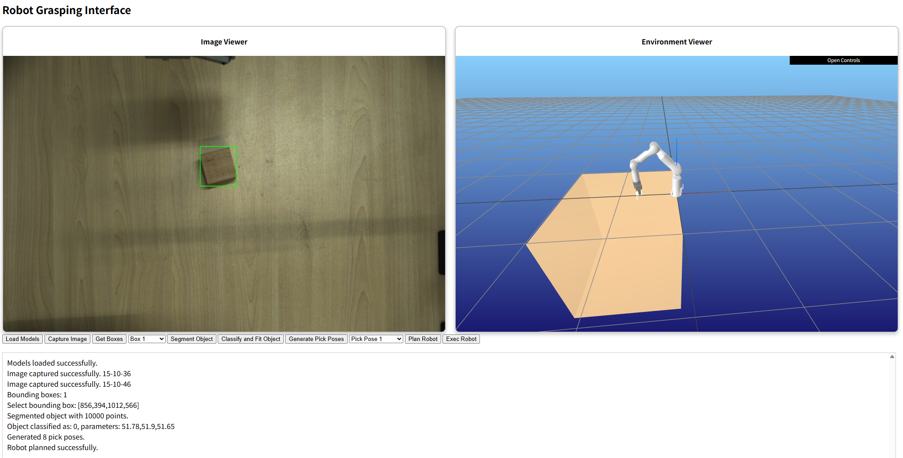

# LGGPF

Language-Guided Grasping via Primitive Fitting (LGGPF) is a research codebase for open-vocabulary robotic grasping. Given a language instruction such as `pick up the cup`, the system detects the target object, segments it, fits a basic geometric primitive, generates feasible grasp poses, plans a collision-aware robot trajectory, and executes the grasp.

This repository restructures the original paper code into a cleaner Python package with a Flask web demo, YAML configuration, and optional hardware integration.

## Interface Preview



## Highlights

- Language-guided object selection with OWLv2
- Prompted instance segmentation with SAM
- Primitive fitting for cuboids, truncated cones, and ellipsoids
- Grasp pose generation with feasibility filtering for a two-finger gripper
- Collision-aware joint-space planning for the RealMan RM-65 robot
- Web interface for step-by-step execution of the full pipeline
- Optional hardware imports so the package remains importable without vendor SDKs

## Pipeline

1. Language instruction
2. Open-vocabulary detection with OWLv2
3. Instance segmentation with SAM
4. Depth-to-point-cloud conversion
5. Primitive fitting and model selection
6. Grasp pose generation and filtering
7. Robot trajectory planning
8. Robot execution

## Repository Layout

```text
lggpf/
├── config/
│   ├── default.yaml
│   └── rm65/
├── data/
│   └── models/
├── src/lggpf/
│   ├── pipeline.py
│   ├── config.py
│   ├── camera/
│   ├── detection/
│   ├── segmentation/
│   ├── shape_fitting/
│   ├── grasp/
│   ├── robot/
│   └── utils/
├── web/
│   ├── app.py
│   └── templates/
├── visualize_pipeline.py
└── benchmark_latency.py
```

## Requirements

- Python 3.10+
- A CUDA-capable GPU is recommended for OWLv2 and SAM
- Pretrained model weights placed under `data/models/`
- Vendor SDKs for real hardware:
  - Mech-Mind SDK (`mecheye`)
  - RealMan SDK (`Robotic_Arm`)

## Installation

### Option 1: Core package with `uv`

Use this if you want the Python package, fitting pipeline, and web app dependencies.

```bash
git clone https://github.com/<your-org>/lggpf.git
cd lggpf
uv sync
uv sync --extra web
```

### Option 2: Windows robot setup with Conda + pip

On Windows, the robot planning stack is more reliable through `conda-forge` because the PyPI dependency chain for `pin` and `coal` may resolve to `cmeel-*` wheels that are unavailable on `win_amd64`.

Recommended workflow:

```bash
conda create -n lggpf python=3.10
conda activate lggpf
conda install -c conda-forge pinocchio coal meshcat
pip install -e .
pip install -e ".[web]"
```

If you already have a working Conda environment with `pinocchio`, `coal`, and `meshcat`, you can reuse it and only install this repository into that environment.

### Optional extras

- `web`: Flask-based demo UI
- `robot`: PyPI robot stack (`pin`, `coal`, `meshcat`)

Note: `.[robot]` may work on Linux, but it is not recommended on Windows.

## Model Weights

Place the following files under `data/models/`:

| Component | Expected path |
| --- | --- |
| OWLv2 | `data/models/owlv2-base-patch16-ensemble/` |
| SAM ViT-H checkpoint | `data/models/sam_vit_h_4b8939.pth` |
| PointNet2 checkpoint | `data/models/best_model_5000.pth` |

## Configuration

Runtime parameters are stored in `config/default.yaml`, including:

- camera IP and intrinsics
- hand-eye calibration matrices
- model paths
- gripper settings
- language keyword mapping
- trajectory planning parameters
- logging and artifact saving behavior

## Running the Web App

After installing the package into your environment:

```bash
python -m flask --app web.app run --port 5000
```

Open `http://127.0.0.1:5000` in your browser.

The UI exposes the pipeline as individual steps:

1. load models
2. capture RGB-D image
3. detect target boxes from text
4. choose a box
5. segment the object
6. fit the primitive model
7. generate pick poses
8. plan the robot trajectory
9. execute the robot motion

## Programmatic Usage

```python
from lggpf.config import load_config
from lggpf.pipeline import GraspingPipeline

cfg = load_config("config/default.yaml")
pipeline = GraspingPipeline(cfg)

pipeline.load_models()
pipeline.capture_image()
pipeline.detect_objects("red cup")
pipeline.select_box(1)
pipeline.segment_object()
result = pipeline.classify_and_fit()
pipeline.generate_pick_poses()

if pipeline.plan_trajectory(1):
    pipeline.execute()
```

## Dissertation & Research Tools

The repository includes two dedicated CLI suites designed for doctoral dissertation evaluation, statistical benchmarking, and publication-quality figure generation.

### 1. Publication Pipeline Visualizer (`visualize_pipeline.py`)

Generates end-to-end composite 6-stage visualization figures for academic publications and thesis defense (corresponding to Figures 5.14, 5.15, and 5.16 in Chapter 5 of the doctoral thesis).

Each generated figure contains 6 synchronized subplots:
- **(a) OWLv2 目标检测定位 (Open-Vocabulary Detection)**: High-resolution bounding box with cross-modal alignment score.
- **(b) SAM 提示式实例分割 (Prompted Instance Segmentation)**: Color-coded mask overlay with pixel count statistics.
- **(c) 点云逆投影与表面法向场 (Point Cloud & Surface Normals)**: Perspective depth unprojection with camera-oriented normal vectors.
- **(d) 基元拟合 (Primitive Fitting)**: 3D wireframe manifold for cuboids, truncated cones, or ellipsoids.
- **(e) 候选抓取位姿与夹爪 (Candidate Grasp Poses & Gripper)**: Discrete candidate grasp poses with 3D physical two-finger gripper model.
- **(f) 五次多项式 $C^2$ 平滑轨迹 (Quintic Trajectory Planning)**: 3D spatial approach, descent, and lift trajectories with workpiece point cloud and compact legend.

**Usage Examples**:
```bash
# Render single-object baseline (paper cup)
python visualize_pipeline.py --session data/success/single/16-23-49 --save-dir ../../figures/chapter5 --name 5_pipeline_single.png

# Render spatial part-constrained grasp (hand cream tube end)
python visualize_pipeline.py --session data/success/position/17-28-15 --save-dir ../../figures/chapter5 --name 5_pipeline_position.png

# Render cluttered multi-object grasp (cup among obstacles)
python visualize_pipeline.py --session data/success/multi/22-25-56 --save-dir ../../figures/chapter5 --name 5_pipeline_multi.png

# Optional flags:
#   --mode auto|full|geometry   Execution mode (default: auto)
#   --show-joint-inset          Render 2D joint-space trajectory profile in Subplot (f)
#   --dpi 300                   Output resolution (default: 300)
```

### 2. Modular Latency Benchmark Suite (`benchmark_latency.py`)

A precision timing evaluation suite for measuring wall-clock latency across all modular pipeline stages (generating Table 5.4 in Chapter 5 of the doctoral dissertation).

**Key Features**:
- **Precise Timing**: Isolates execution time for each stage:
  1. OWLv2 detection latency
  2. SAM segmentation latency
  3. Depth back-projection & normal estimation latency
  4. Multi-primitive competitive RANSAC fitting latency
  5. Grasp manifold generation & feasibility filtering latency
  6. Quintic polynomial trajectory planning latency
  7. End-to-end total pipeline latency
- **CUDA Synchronization**: Uses `torch.cuda.synchronize()` to eliminate asynchronous GPU timing artifacts.
- **Statistical Aggregation**: Computes mean, standard deviation, median, min, max, and percentage breakdowns across session subsets (`single`, `multi`, `position`).
- **Thesis-Ready Export**: Automatically formats results into a terminal table, JSON log, and LaTeX table snippet ready for inclusion in the thesis.

**Usage Examples**:
```bash
# Run full benchmark on single-object recordings
python benchmark_latency.py --mode auto --subsets single

# Benchmark all subsets (single, multi, position)
python benchmark_latency.py --mode auto --subsets single multi position

# Benchmark in offline geometry mode (without heavy neural models)
python benchmark_latency.py --mode geometry --all
```

## Platform Notes

- The package can be imported without the Mech-Mind or RealMan SDKs.
- Camera access requires the `mecheye` SDK.
- Real robot execution requires the `Robotic_Arm` SDK.
- Collision planning and MeshCat visualization require Pinocchio, Coal, and MeshCat.
- On Windows, use Conda for the robot planning stack when possible.

## Current Scope and Limitations

- The repository is focused on the Flask web workflow, not the original CLI or Tk GUI.
- The current robot configuration targets the RealMan RM-65 setup included in `config/rm65/`.
- Model checkpoints are not bundled with the repository.
- The language-guided primitive selection uses keyword heuristics before fitting.

## Reproducibility Notes

For best reproducibility, document the following when reporting results:

- Python version
- OS and GPU
- exact model checkpoints used
- calibration matrices in `config/default.yaml`
- whether planning/execution was run in simulation or on hardware

## License

This project is released under the MIT License. See `LICENSE`.

## Citation

If you use this repository in research, please cite the associated paper.

```bibtex
@article{niu2025language,
  title={Language-Guided Robot Grasping Based on Basic Geometric Shape Fitting},
  author={Niu, Qun and Zhang, Chuanlin and Zhang, Tianyu and Zhao, Jieliang and Fu, Tie and Chen, Xuemei},
  journal={Advanced Intelligent Systems},
  pages={e202501276},
  year={2025},
  publisher={Wiley Online Library}
}
```

## Acknowledgments

This project builds on several open-source tools and models, including OWLv2, Segment Anything, Open3D, SpatialMath, Pinocchio, Coal, and MeshCat.
